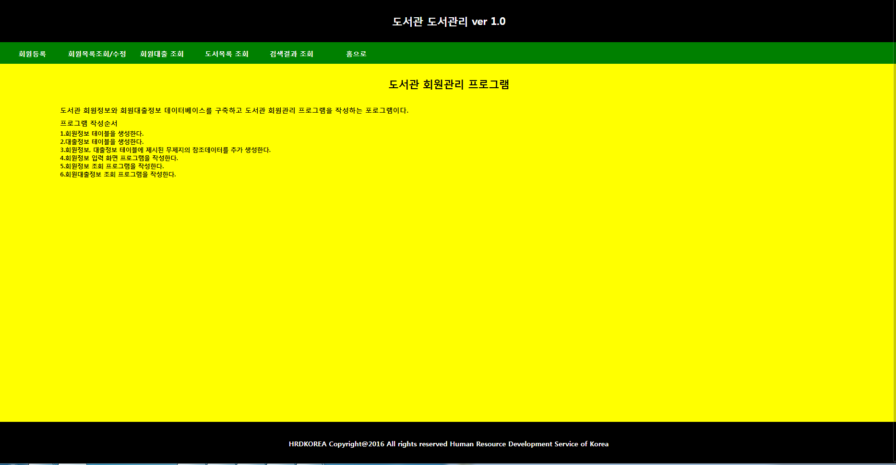
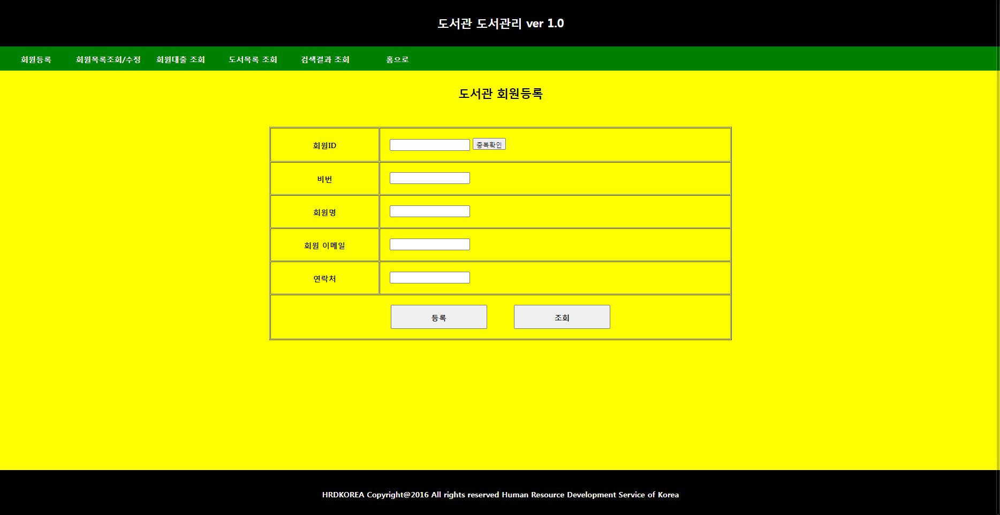
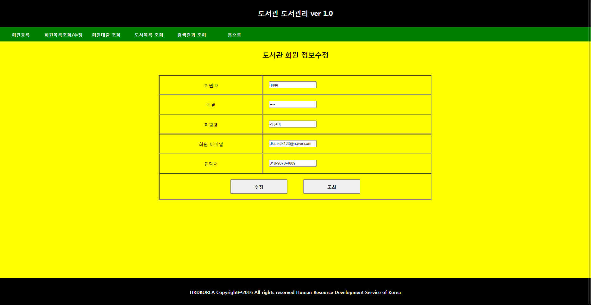

# 1. 메인화면

  
  

## 설명 
### 도서관리 프로그램에 관리자 페이지 메인화면이다. header, nav, content, footer로 나눠져 있고 nav에 있는 a태그를 클릭하면 다른 페이지로 이동한다.
### 지금 작성한 도서 관리 프로그램은 간단한 관리자 페이지를 작성하였기 때문에 MVC1 방식을 사용하여 만들었다.

----------------------------------------------------------------------------------------------------------------------------------------------

# 2. 회원등록

  
  

## 설명 
### 회원을 등록할수 있는 페이지다. 각 개인정보에 값을 입력하지 않았을때 "입력되지 않았습니다" 라는 alert문이 나오고 전부 입력했으면 "등록 완료!" alert구문이 나온다.

----------------------------------------------------------------------------------------------------------------------------------------------

# 3. 회원목록조회

  
  

## 설명 
### 회원목록 조회를 할수 있는 화면이다. 가입이 되어있는 회원에 정보가 나오고 아이디 부분을 클릭하면 회원수정 페이지로 이동하게 된다.

----------------------------------------------------------------------------------------------------------------------------------------------

# 4. 회원수정

  
  

## 설명 
### 회원 수정을 할수 있는 페이지다. request.Parameter(p_id)를 사용하여 아이디 값으로 수정할 회원에 정보를 끌어오고 수정할려는 값이 비어 있으면
### "값이 비어 있습니다." 라는 alert구문이 나오고 수정 버튼을 누르면 "수정 완료" 라는 alert 구문이 나오면서 회원목록조회 페이지로 이동하게 된다.

----------------------------------------------------------------------------------------------------------------------------------------------

# 5. 회원대출 조회

  
  

## 설명 
### 회원대출 조회 페이지다. custom_01,reservation_tbl 두 테이블을 조인하여 값을 출력하였다.

----------------------------------------------------------------------------------------------------------------------------------------------

# 6. 도서목록 조회

  
  

## 설명 
### 도서목록 조회 페이지다. reservation_tbl, bookinfo_tbl 두 테이블을 조인하여 값을 출력하였다. 

----------------------------------------------------------------------------------------------------------------------------------------------

# 7. 검색결과 조회

  
  

## 설명 
### 검색결과 조회 페이지다. custom_01, reservation_tbl, bookinfo_tbl 세개의 테이블을 조인하여 값을 출력하였다.

----------------------------------------------------------------------------------------------------------------------------------------------
